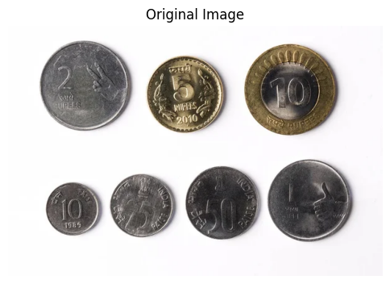
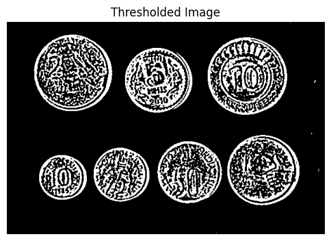
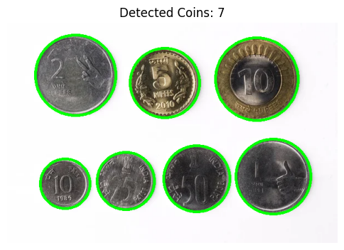

---

# **VR_Assignment1_NupurPatil_IMT2022520**  

## **Part 1: Coin Detection and Segmentation**  

### **1. Overview**  
This project performs **coin detection and segmentation** using **image processing techniques** in Python. It detects circular objects (coins), outlines them, and segments them individually for further analysis.  

### **2. Features**  
- **Preprocessing:** Converts the image to grayscale and applies Gaussian blur.  
- **Thresholding:** Uses Adaptive Gaussian Thresholding to enhance coin regions.  
- **Contour Detection:** Extracts external contours of objects in the image.  
- **Coin Filtering:** Filters valid coins based on area and circularity.  
- **Visualization:** Draws circles around detected coins and displays intermediate outputs.  
- **Segmentation:** Isolates each detected coin and removes the background.  

---

### **3. Installation & Dependencies**  
Ensure you have **Python 3.x** installed along with the following dependencies:  
```bash
pip install opencv-python numpy matplotlib
```

---

### **4. How to Run (Coin Detection & Segmentation)**  
1. Clone the repository:  
```bash
git clone https://github.com/NupurP04/VR_Assignment1_NupurPatil_IMT2022520.git  
cd VR_Assignment1_NupurPatil_IMT2022520
```

2. Navigate to the **coin_detection_and_segmentation** folder. Inside the **input_images** directory, `coins.jpg` is the input image used in the script.  

3. Execute the Jupyter Notebook **VR_ass1_coin.ipynb**.  

---

### **5. Methodology**  
#### Step 1: Image Preprocessing  
- Convert the image to grayscale.  
- Apply **Gaussian Blur** to remove noise.  
- Display intermediate outputs.  

#### Step 2: Thresholding  
- Use **Adaptive Gaussian Thresholding** to highlight coins.  

#### Step 3: Contour Detection  
- Extract contours from the thresholded image.  

#### Step 4: Filtering & Drawing Coins  
- Filter coins based on **area and circularity** constraints.  
- Draw circles around valid coins.  

#### Step 5: Segmentation  
- Apply **region-based segmentation** using contour bounding boxes.  
- Create a mask to remove the background.  

---

### **6. Results & Observations**  
- The algorithm successfully detects coins in the image and segments them individually.  
- The total number of detected coins is printed.  

#### **Some of the Outputs**  
| **Original Image** | **Thresholded Image** | **Detected Coins** |  
|-----------------|-----------------|-----------------|  
|  |  |  |  

---

### **7. What Was Tried, What Worked, and What Didn’t**  

#### **What I Tried:**  
1. **Hough Circle Transform** for circle detection.  
2. **Canny Edge Detection + Contour Approximation**.  
3. **Adaptive Gaussian Thresholding + Contour Filtering**.  

#### **What Worked:**  
**Adaptive Gaussian Thresholding + Contour Filtering** provided the most accurate and robust coin detection.  
**Filtering based on circularity and area constraints** helped eliminate false detections.  
**Masking technique for segmentation** effectively removed the background.  

#### **What Didn’t Work:**  
**Hough Circle Transform** detected many false positives and struggled with overlapping coins.  
**Canny Edge Detection + Contours** produced noisy results, making segmentation harder.  

#### **Final Approach:**  
- **Adaptive Gaussian Thresholding** for better contrast.  
- **Contour detection & filtering based on circularity** for accurate coin selection.  
- **Segmentation using masking** to isolate individual coins.  

---

## **Part 2: Panorama Stitching**  

### **1. Overview**  
This project performs **panorama stitching** using **feature-based image alignment** in Python. It detects key points in images, matches them, and stitches them together to create a seamless panorama.  

### **2. Features**  
- **Feature Detection:** Uses **SIFT (Scale-Invariant Feature Transform)** to extract keypoints.  
- **Feature Matching:** Utilizes **FLANN-based matcher** for fast and accurate feature matching.  
- **Homography Computation:** Computes **perspective transformation** using RANSAC.  
- **Image Warping:** Aligns images using homography transformation.  
- **Cropping & Blending:** Removes black regions and ensures a clean panorama.  

---

### **3. Installation & Dependencies**  
Ensure you have **Python 3.x** installed along with the following dependencies:  
```bash
pip install opencv-python numpy matplotlib
```

---

### **4. How to Run (Panorama Stitching)**  
1. Clone the repository (if not already done):  
```bash
git clone https://github.com/NupurP04/VR_Assignment1_NupurPatil_IMT2022520.git  
cd VR_Assignment1_NupurPatil_IMT2022520
```

2. Navigate to the **panorama_stitching** folder. Inside the **input_images** directory, store the images (`p1.jpeg`, `p2.jpeg`, `p3.jpeg`) that need to be stitched.  

3. Execute the Jupyter Notebook **VR_ass1_panorama.ipynb**.  

---

### **5. Methodology**  
#### Step 1: Feature Detection  
- Extracts **SIFT keypoints** and descriptors from images.  

#### Step 2: Feature Matching  
- Uses **FLANN-based matcher** with **Lowe’s Ratio Test** to filter good matches.  

#### Step 3: Homography Computation  
- Uses **RANSAC** to compute the transformation between images.  

#### Step 4: Image Warping & Stitching  
- **Warp the images** using the computed homography matrix.  
- **Merge images** by overlaying them correctly.  

#### Step 5: Cropping & Blending  
- Converts to grayscale and removes black borders.  

---

### **6. Results & Observations**  
- The algorithm successfully stitches images together into a seamless panorama.  
- Feature detection and matching work effectively with **SIFT + FLANN + Homography**.  

#### **Sample Outputs**  
| **Image 1** | **Image 2** | **Image 3** | **Stitched Panorama** |  
|------------|------------|------------|----------------|  
|  |  |  |  |  

---

### **7. What Was Tried, What Worked, and What Didn’t**  

#### **What I Tried:**  
1. **ORB (Oriented FAST and Rotated BRIEF) instead of SIFT.**  
2. **Brute Force Matcher vs. FLANN-based Matcher.**  
3. **Direct stitching without homography transformation.**  

#### **What Worked:**  
**SIFT + FLANN Matcher + RANSAC Homography** produced the best alignment.  
**Using grayscale images for feature detection** improved accuracy.  
**Cropping after warping** removed black regions effectively.  

#### **What Didn’t Work:**  
**ORB + Brute Force Matcher** produced weak feature matches.  
**Skipping Homography transformation** caused misaligned images.  

#### **Final Approach:**  
- **SIFT for feature extraction.**  
- **FLANN-based Matcher for better accuracy.**  
- **Homography transformation with RANSAC for precise alignment.**  

---
