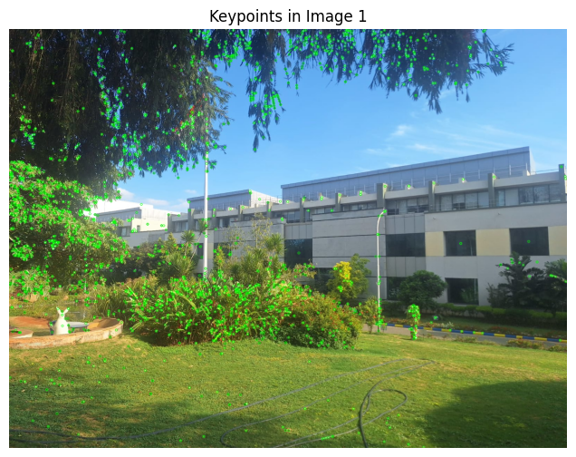
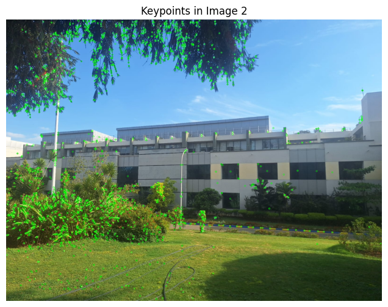
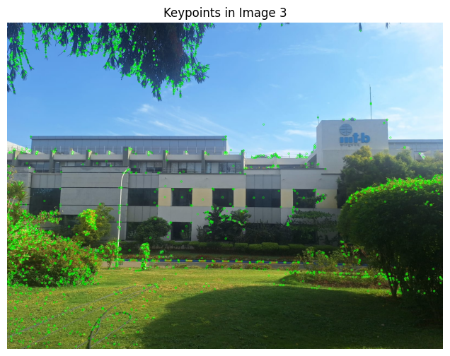
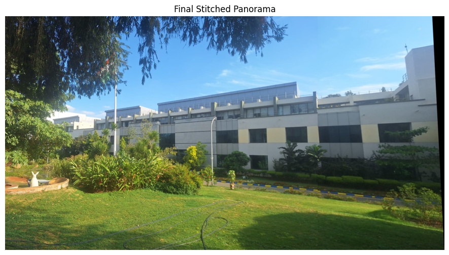

---

# **VR_Assignment1_NupurPatil_IMT2022520**  

## **Part 1: Coin Detection and Segmentation**  

### **1. Overview**  
This project performs **coin detection and segmentation** using **image processing techniques** in Python. It detects circular objects (coins), outlines them, and segments them individually for further analysis.  

### **2. Features**  
- **Preprocessing:** Converts the image to grayscale and applies Gaussian blur.  
- **Thresholding:** Uses Adaptive Gaussian Thresholding to enhance coin regions.  
- **Contour Detection:** Extracts external contours of objects in the image.  
- **Coin Filtering:** Filters valid coins based on area and circularity.  
- **Visualization:** Draws circles around detected coins and displays intermediate outputs.  
- **Segmentation:** Isolates each detected coin and removes the background.  

---

### **3. Installation & Dependencies**  
Ensure you have **Python 3.x** installed along with the following dependencies:  
```bash
pip install opencv-python numpy matplotlib
```

---

### **4. How to Run (Coin Detection & Segmentation)**  
1. Clone the repository:  
```bash
git clone https://github.com/NupurP04/VR_Assignment1_NupurPatil_IMT2022520.git  
cd VR_Assignment1_NupurPatil_IMT2022520
```

2. Inside the **input_images** directory, `coins.jpg` is the input image used in the script. Copy the path accordingly.  

3. Navigate to the **coin_detection_and_segmentation** folder and execute the Jupyter Notebook **VR_ass1_coin.ipynb**.  

---

### **5. Methodology**  
#### Step 1: Image Preprocessing  
- Convert the image to grayscale.  
- Apply **Gaussian Blur** to remove noise.  
- Display intermediate outputs.  

#### Step 2: Thresholding  
- Use **Adaptive Gaussian Thresholding** to highlight coins.  

#### Step 3: Contour Detection  
- Extract contours from the thresholded image.  

#### Step 4: Filtering & Drawing Coins  
- Filter coins based on **area and circularity** constraints.  
- Draw circles around valid coins.  

#### Step 5: Segmentation  
- Apply **region-based segmentation** using contour bounding boxes.  
- Create a mask to remove the background.  

---

### **6. Results & Observations**  
- The algorithm successfully detects coins in the image and segments them individually.  
- **Intermediate results** (grayscale, blurred, thresholded, detected, and segmented images) are displayed.  
- The total number of detected coins is printed.  

#### **Sample Outputs**  
| **Original Image** | **Thresholded Image** | **Detected Coins** |  
|-----------------|-----------------|-----------------|  
|  |  |  |  

---

## **Part 2: Panorama Stitching**  

### **1. Overview**  
This project performs **panorama stitching** using **feature-based image alignment** in Python. It detects key points in images, matches them, and stitches them together to create a seamless panorama.  

### **2. Features**  
- **Feature Detection:** Uses **SIFT (Scale-Invariant Feature Transform)** to extract keypoints.  
- **Feature Matching:** Utilizes **FLANN-based matcher** for fast and accurate feature matching.  
- **Homography Computation:** Computes **perspective transformation** using RANSAC.  
- **Image Warping:** Aligns images using homography transformation.  
- **Cropping & Blending:** Removes black regions and ensures a clean panorama.  

---

### **3. Installation & Dependencies**  
Ensure you have **Python 3.x** installed along with the following dependencies:  
```bash
pip install opencv-python numpy matplotlib
```

---

### **4. How to Run (Panorama Stitching)**  
1. Clone the repository (if not already done):  
```bash
git clone https://github.com/NupurP04/VR_Assignment1_NupurPatil_IMT2022520.git  
cd VR_Assignment1_NupurPatil_IMT2022520
```

2. Inside the **input_images** directory, store the images (`p1.jpeg`, `p2.jpeg`, `p3.jpeg`) that need to be stitched.  

3. Navigate to the **panorama_stitching** folder and execute the Jupyter Notebook **VR_ass1_panorama.ipynb**.  

---

### **5. Methodology**  
#### Step 1: Feature Detection  
- Extracts **SIFT keypoints** and descriptors from images.  

#### Step 2: Feature Matching  
- Uses **FLANN-based matcher** with **Lowe’s Ratio Test** to filter good matches.  

#### Step 3: Homography Computation  
- Uses **RANSAC** to compute the transformation between images.  

#### Step 4: Image Warping & Stitching  
- **Warp the images** using the computed homography matrix.  
- **Merge images** by overlaying them correctly.  

#### Step 5: Cropping & Blending  
- Converts to grayscale and removes black borders.  

---

### **6. Results & Observations**  
- The algorithm successfully stitches images together into a seamless panorama.  
- Feature detection and matching work effectively with **SIFT + FLANN + Homography**.  

#### **Sample Outputs**  
| **Image 1** | **Image 2** | **Image 3** | **Stitched Panorama** |  
|------------|------------|------------|----------------|  
|  |  |  |  |  

---

## **Final Notes**  
- The **coin detection model** accurately identifies and segments coins from images.  
- The **panorama stitching model** effectively aligns images and produces high-quality stitched results.  
- **All visual outputs are saved in their respective `output_images` folders.**  

---

### **7. Repository Structure**  
```
VR_Assignment1_NupurPatil_IMT2022520/
│── coin_detection_and_segmentation/
│   ├── VR_ass1_coin.ipynb
│   ├── input_images/
│   │   ├── coins.jpg
│   ├── output_images/
│   │   ├── blurred_image.png
│   │   ├── detected_coin_border_image.png
│   │   ├── grayscale_image.png
│   │   ├── original_image.png
│   │   ├── thresholded_image.png
│   │   ├── segmented_coin1.png
│   │   ├── segmented_coin2.png
│   │   ├── segmented_coin3.png
│   │   ├── segmented_coin4.png
│   │   ├── segmented_coin5.png
│   │   ├── segmented_coin6.png
│   │   ├── segmented_coin7.png
│   │   ├── thresholded_image.png
│── panorama_stitching/
│   ├── VR_ass1_panorama.ipynb
│   ├── input_images/
│   │   ├── p1.jpeg
│   │   ├── p2.jpeg
│   │   ├── p3.jpeg
│   ├── output_images/
│   │   ├── keypoints_p1.png
│   │   ├── keypoints_p2.png
│   │   ├── keypoints_p3.png
│   │   ├── panorama.png
│── README.md
```

---

